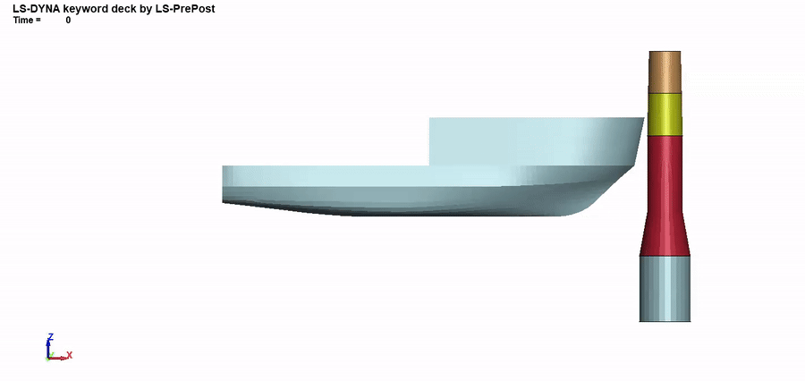
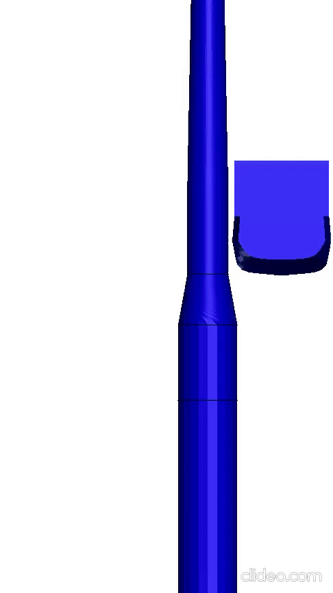
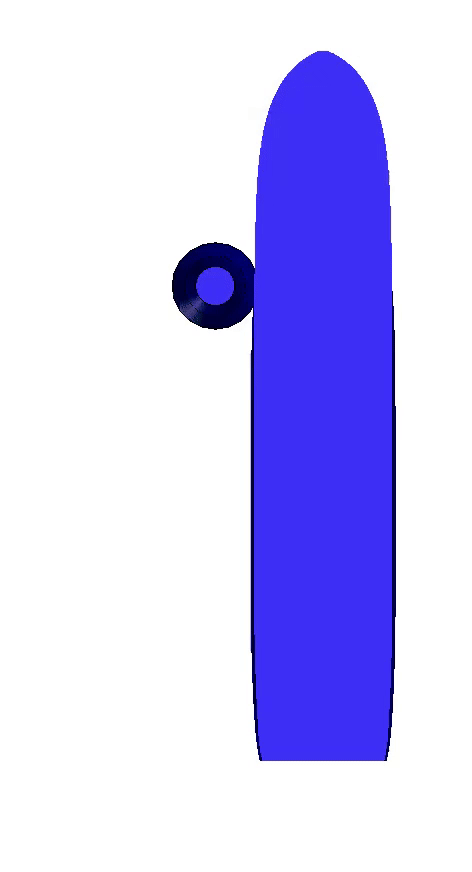

# How should we model a ship colliding with a floating wind turbine?

**EMship Master’s thesis / research internship**  
*Investigation of ship structural modelling for collision analysis with floating offshore wind turbines*

What happens when a ship strikes an offshore wind turbine? Which structure deforms, where does the collision energy go, and how much detail do we need to reproduce the event in a numerical model?

This project invites a student to explore these questions using **LS-DYNA, Python and parametric modelling**. You will build ship models, run collision simulations and investigate which modelling choices make a meaningful difference to the results.

## From real collisions to numerical models

  

*The Njord Forseti collision with a wind turbine foundation at Borkum Rifgrund in April 2020. The first damage photograph below shows the same vessel following this incident. Source: [IMCA / Jersey Maritime Administration](#ref-imca).*

Our work so far has focused on the response of **deformable offshore wind turbine supports struck by a rigid ship**. This means the ship can move, but its structure cannot bend, buckle or crush. The turbine support is allowed to deform.

Previous Master’s and doctoral research has investigated how to represent these collisions and which modelling assumptions influence the response. The examples below show three contributions to this research.

### Representing the interaction with water

In his Master’s thesis, **Abhemanyu Palaniswamy Chandrasekaran** coupled the ship collision model with **MCOL** to account for hydrodynamic effects. He compared this approach with a fully coupled **Eulerian–Lagrangian simulation**, in which the water and structures are represented together, to assess the validity of the MCOL-based approach. This work addressed an essential modelling question: how can we account for the surrounding water without having to model the fluid explicitly in every collision simulation? [Read the thesis reference.](#ref-abhe)

  

*Collision simulation from the Master’s thesis of Abhemanyu Palaniswamy Chandrasekaran (2024).*

### Understanding the influence of ship rolling

**John Mathinji Karatu** investigated side collisions with a floating offshore wind turbine, focusing on the influence of **ship rolling motion**. Rolling changes how the ship side comes into contact with the turbine support and can increase the severity of the collision. His work examined this effect on the collision response, highlighting why the ship’s motion deserves attention alongside its impact velocity and geometry. The possibility of greater damage to both structures also motivates the next step: explicitly representing ship deformation. [Read the thesis reference.](#ref-john)

| View of the support | View of the ship motion |
|:---:|:---:|
|  |  |

*Two views from John Mathinji Karatu’s Master’s thesis (2026), showing the support response and the motion of the ship during a side collision.*

### Identifying the modelling choices that matter

In her doctoral thesis, **Sara Echeverry Jaramillo** carried out a parametric investigation of ship impacts on a spar-like floating offshore wind turbine. Her study considered factors such as **impactor mass, impact velocity, hydrodynamic coupling through MCOL, the inclusion of gravity, ...** The aim was to understand how these choices affect the predicted response and to identify what needs to be represented in a collision model. This provides a foundation for applying the same approach to the ship structure in the proposed thesis. [Read the thesis reference.](#ref-sara)

  

*Illustration from Sara Echeverry Jaramillo’s doctoral thesis on the numerical and analytical study of a spar-like floating offshore wind turbine impacted by a ship.*

## But how realistic is a perfectly rigid ship?

Real ships can sustain substantial structural damage. Their hull plating and internal structure can deform and absorb part of the collision energy. A rigid-ship model cannot represent that contribution.

  
  
  

*From left to right:*

- **Njord Forseti — April 2020:** bow damage following the collision with a wind turbine foundation at Borkum Rifgrund in the North Sea. This is the incident shown in the opening GIF. [IMCA / Jersey Maritime Administration](#ref-imca).
- **Wind of Hope — 19 September 2024:** damage to the starboard side above the waterline, including the helideck; minor damage to the turbine base was also reported.
- **Petra L. — 2023:** hull damage following a collision with an offshore wind turbine at Gode Wind 1 in Germany.

*These real incidents illustrate why ship deformation matters. They are contextual examples, not matched validation cases for the simulations above.*

This leads to our next question: **when is the rigid-ship assumption sufficient, and when do we need to model ship deformation explicitly?** Answering it requires a practical way to generate and compare deformable ship models.

## The next step is the ship

We have developed simplified collision models and finite element studies of the turbine support, including work on its interaction with the surrounding water. The next stage is to investigate the ship structure with the same attention.

| Previous work: turbine deformation | → | This project: ship deformation |
|:---:|:---:|:---:|
|  | **Next step** |  |
| Rigid ship and deformable support | | Deformable ship and initially rigid support |

*Conceptual animations, not finite element results. The fixed support in the right-hand sketch is an idealised starting point for isolating ship deformation. Structural rigidity and floating-body motion are separate modelling choices: a rigid floating support may still translate and rotate.*

The initial comparisons will focus on the ship against an idealised rigid support. They will prepare the ship component for integration into the wider ship–floating wind turbine collision framework, and ultimately for studies in which both structures deform.

## What will you investigate?

The central question is **how detailed a ship model needs to be to capture the collision response at a reasonable computational cost**. The project will use controlled ship-like configurations; reproducing every detail of a particular vessel is not the starting requirement.

*Illustrative modelling choices only. These sketches are not meshes, validated equivalent models or predicted results.*

Three possible comparisons will guide the study:

- **Structural detail:** compare an equivalent plate representation with panels in which the stiffeners are modelled explicitly. How does the choice affect deformation and the force required to crush the structure?
- **Hull shape:** compare a simple box-like geometry with a more representative curved hull. Which geometric features matter near the contact region?
- **Interaction with water:** where the coupled framework permits, compare simplified and more representative hull geometries for the hydrodynamic model. How much does that change the global motion and collision response?

The exact comparisons will be selected with the supervisors to keep the project manageable. Mesh sensitivity and consistent comparison conditions will help distinguish numerical effects from differences caused by the modelling assumptions.

## Your work during the thesis

1. **Explore the literature.** Review ship collision modelling, stiffened panels and impacts against tubular structures. Identify relevant published comparisons or benchmark cases where available.
2. **Build a parametric ship model.** Use Python to generate LS-DYNA models with adjustable geometry, plating and structural arrangements. Establish a working reference configuration before adding complexity.
3. **Prepare repeatable simulations.** Automate model preparation and extraction of the main results so that modelling choices can be compared systematically.
4. **Run a focused comparison study.** Examine deformation patterns, collision forces, absorbed energy and, where relevant, global motion. Compare simplified models with more detailed numerical references and suitable published cases.
5. **Explain the mechanics.** Identify why the results change and whether additional detail is worth the extra modelling and simulation time. Turn these findings into practical recommendations.

The wind turbine models and the existing coupling framework will be provided as a starting point. The student’s main responsibility will be the **ship modelling methodology and its assessment**.

## What will you gain?

You will gain experience in Python-based engineering automation, parametric model generation, nonlinear finite element analysis with LS-DYNA, and interpretation of structural collision behaviour. You will also learn to assess the limitations of a numerical model and communicate the evidence behind a modelling decision.

This project would suit a student who:

- enjoys structural mechanics and understanding how structures deform;
- has good Python programming skills and likes building reusable tools;
- is interested in numerical simulation and willing to learn LS-DYNA;
- enjoys checking results, testing assumptions and explaining physical behaviour.

## How the work continues

The Master's thesis will deliver a reusable ship modelling procedure, a documented set of comparison simulations and recommendations on the required level of structural detail. These outputs will support wider collision studies and the future development of simplified analytical models of ship deformation within the ongoing PhD research.

The student will have an independent research question and will interpret their own comparison study. The subsequent large-scale simulation campaign and analytical model development form the longer-term research outlook.

## Interested?

**Research contact:** Gabriel Vandegar — University of Liège, ArGEnCo/ANAST.  
Contact and practical arrangements will be provided through the EMship topic proposal.

## References and media sources

**Palaniswamy Chandrasekaran, Abhemanyu (2024).** *Numerical Simulation of Ship-Floating Offshore Wind Turbine Collision Using the Coupled Eulerian Lagrangian Approach.* Master’s thesis, submitted 30 July 2024. Source of `02_media1_abhe.mp4`.

**Karatu, John Mathinji (2026).** *Numerical Modelling of Ship Side-Collision with a Floating Offshore Wind Turbine (FOWT).* Master’s thesis, submitted 20 August 2026. Source of `03_1_Media1_John.mp4` and `03_2_Media2_John.mp4`.

**Echeverry Jaramillo, Sara.** *Numerical and analytical study of a spar-like floating offshore wind turbine impacted by a ship.* Dissertation submitted for the degree of Doctor in Applied Sciences. Source of `04_image11_sarah.gif`. Publication year and repository link to be added.

**International Marine Contractors Association (IMCA) (n.d.).** *Windfarm Support Vessel Njord Forseti hit wind turbine tower – Jersey Maritime Administration – IMCA.* [Incident reference](https://www.imca-int.com/safety-events/windfarm-support-vessel-njord-forseti-hit-wind-turbine-tower-jersey-maritime-administration/). Reference supplied for the opening collision GIF and the Njord Forseti damage photograph.

**Other incident photographs:** Wind of Hope, 19 September 2024 (`05_2_Picture4.png`), and Petra L., Gode Wind 1, Germany, 2023 (`05_3_Picture5.jpg`). Original image credits and source links to be completed.
